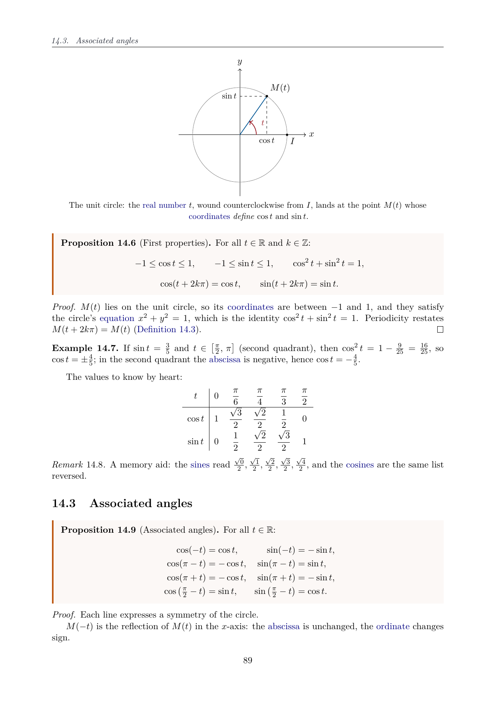
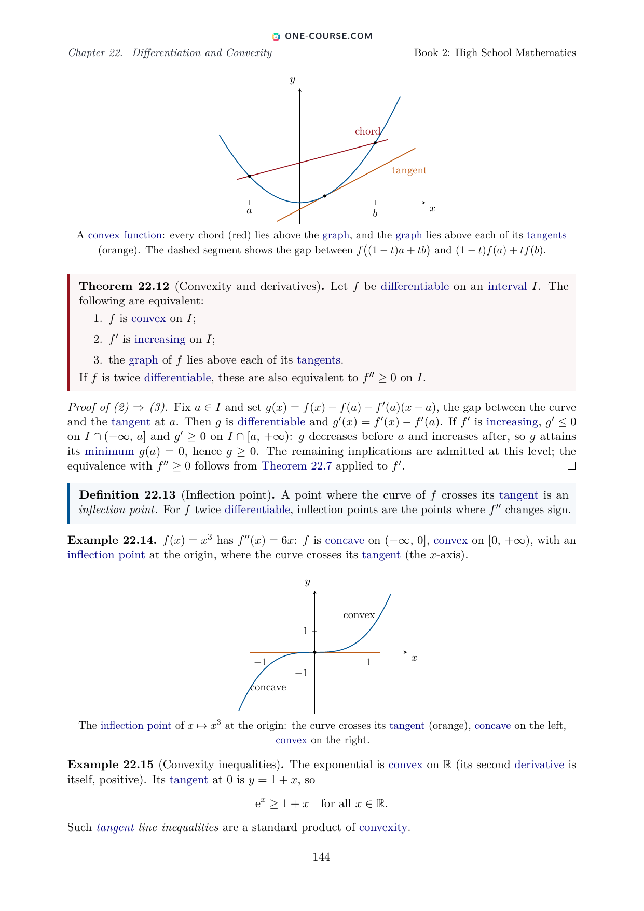
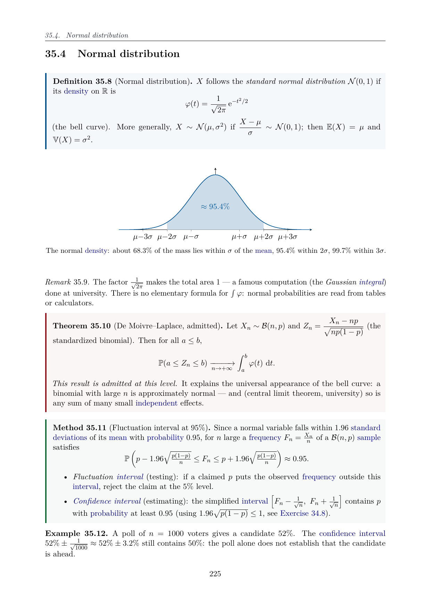

# One Math Book

<p align="center">
  <a href="https://www.one-course.com">
    
  </a>
</p>

<p align="center">
  <a href="https://github.com/bvirrion/one-math-book/releases/latest"></a>
  <a href="https://github.com/bvirrion/one-math-book/releases"></a>
  <a href="https://github.com/bvirrion/one-math-book/actions/workflows/release.yml"></a>
  <a href="https://www.one-course.com/books"></a>
</p>

*The One Math Book to Rule Them All.*

> **One Math Book** is part of the **One Course** project — one coherent
> course covering each subject from kindergarten to the end of the
> bachelor's degree. Discover the whole project at
> **[www.one-course.com](https://www.one-course.com)**, and see the sibling
> [One Physics Book](https://github.com/bvirrion/one-physics-book).

A series of five **free mathematics textbooks** forming a single coherent
course **from Grade 1 to the end of the bachelor's degree** — one
notation, one voice, every year building on the previous one. Each book
is available in six complete editions: **English, French, Dutch, Spanish,
Portuguese and Hindi**. Whether you are a student, a parent, a teacher or
a homeschooling family, you can read every book online or download the
PDF — free of charge:

1. **Primary & Middle School Mathematics** — Grades 1–9;
2. **High School Mathematics** — Grades 10–12;
3. **University Mathematics — Year 1**;
4. **University Mathematics — Year 2**;
5. **University Mathematics — Year 3**.

The style is concise and rigorous: courses built from **definitions,
examples, propositions, theorems and methods**, with proofs whenever they
are accessible at the given level (results admitted without proof are
explicitly marked), followed by graded **exercises with full solutions**
collected at the end of each book. Thousands of generated hyperlinks send
every defined term back to its definition, and every exercise to its
solution.

<p align="center">
  
  
  
</p>
<p align="center"><sub>Three pages from Book 2 (High School): trigonometry, convexity, the normal distribution.</sub></p>

## Read online · Download the PDFs

| Book | Read online | Download PDF |
|------|-------------|--------------|
| **1. Primary & Middle School** (Grades 1–9) | [EN](https://www.one-course.com/books/math/1/en) · [ES](https://www.one-course.com/books/math/1/es) · [FR](https://www.one-course.com/books/math/1/fr) · [NL](https://www.one-course.com/books/math/1/nl) | [EN](https://github.com/bvirrion/one-math-book/releases/latest/download/one_math_book_1_primary_middle_school.pdf) · [ES](https://github.com/bvirrion/one-math-book/releases/latest/download/one_math_book_1_primary_middle_school_es.pdf) · [FR](https://github.com/bvirrion/one-math-book/releases/latest/download/one_math_book_1_primary_middle_school_fr.pdf) · [HI](https://github.com/bvirrion/one-math-book/releases/latest/download/one_math_book_1_primary_middle_school_hi.pdf) · [NL](https://github.com/bvirrion/one-math-book/releases/latest/download/one_math_book_1_primary_middle_school_nl.pdf) · [PT](https://github.com/bvirrion/one-math-book/releases/latest/download/one_math_book_1_primary_middle_school_pt.pdf) |
| **2. High School** (Grades 10–12) | [EN](https://www.one-course.com/books/math/2/en) · [ES](https://www.one-course.com/books/math/2/es) · [FR](https://www.one-course.com/books/math/2/fr) · [NL](https://www.one-course.com/books/math/2/nl) | [EN](https://github.com/bvirrion/one-math-book/releases/latest/download/one_math_book_2_high_school.pdf) · [ES](https://github.com/bvirrion/one-math-book/releases/latest/download/one_math_book_2_high_school_es.pdf) · [FR](https://github.com/bvirrion/one-math-book/releases/latest/download/one_math_book_2_high_school_fr.pdf) · [HI](https://github.com/bvirrion/one-math-book/releases/latest/download/one_math_book_2_high_school_hi.pdf) · [NL](https://github.com/bvirrion/one-math-book/releases/latest/download/one_math_book_2_high_school_nl.pdf) · [PT](https://github.com/bvirrion/one-math-book/releases/latest/download/one_math_book_2_high_school_pt.pdf) |
| **3. University — Year 1** | [EN](https://www.one-course.com/books/math/3/en) · [ES](https://www.one-course.com/books/math/3/es) · [FR](https://www.one-course.com/books/math/3/fr) · [NL](https://www.one-course.com/books/math/3/nl) | [EN](https://github.com/bvirrion/one-math-book/releases/latest/download/one_math_book_3_university_year_1.pdf) · [ES](https://github.com/bvirrion/one-math-book/releases/latest/download/one_math_book_3_university_year_1_es.pdf) · [FR](https://github.com/bvirrion/one-math-book/releases/latest/download/one_math_book_3_university_year_1_fr.pdf) · [HI](https://github.com/bvirrion/one-math-book/releases/latest/download/one_math_book_3_university_year_1_hi.pdf) · [NL](https://github.com/bvirrion/one-math-book/releases/latest/download/one_math_book_3_university_year_1_nl.pdf) · [PT](https://github.com/bvirrion/one-math-book/releases/latest/download/one_math_book_3_university_year_1_pt.pdf) |
| **4. University — Year 2** | [EN](https://www.one-course.com/books/math/4/en) · [ES](https://www.one-course.com/books/math/4/es) · [FR](https://www.one-course.com/books/math/4/fr) · [NL](https://www.one-course.com/books/math/4/nl) | [EN](https://github.com/bvirrion/one-math-book/releases/latest/download/one_math_book_4_university_year_2.pdf) · [ES](https://github.com/bvirrion/one-math-book/releases/latest/download/one_math_book_4_university_year_2_es.pdf) · [FR](https://github.com/bvirrion/one-math-book/releases/latest/download/one_math_book_4_university_year_2_fr.pdf) · [HI](https://github.com/bvirrion/one-math-book/releases/latest/download/one_math_book_4_university_year_2_hi.pdf) · [NL](https://github.com/bvirrion/one-math-book/releases/latest/download/one_math_book_4_university_year_2_nl.pdf) · [PT](https://github.com/bvirrion/one-math-book/releases/latest/download/one_math_book_4_university_year_2_pt.pdf) |
| **5. University — Year 3** | [EN](https://www.one-course.com/books/math/5/en) · [ES](https://www.one-course.com/books/math/5/es) · [FR](https://www.one-course.com/books/math/5/fr) · [NL](https://www.one-course.com/books/math/5/nl) | [EN](https://github.com/bvirrion/one-math-book/releases/latest/download/one_math_book_5_university_year_3.pdf) · [ES](https://github.com/bvirrion/one-math-book/releases/latest/download/one_math_book_5_university_year_3_es.pdf) · [FR](https://github.com/bvirrion/one-math-book/releases/latest/download/one_math_book_5_university_year_3_fr.pdf) · [HI](https://github.com/bvirrion/one-math-book/releases/latest/download/one_math_book_5_university_year_3_hi.pdf) · [NL](https://github.com/bvirrion/one-math-book/releases/latest/download/one_math_book_5_university_year_3_nl.pdf) · [PT](https://github.com/bvirrion/one-math-book/releases/latest/download/one_math_book_5_university_year_3_pt.pdf) |

The PDF links always point at the newest release; the Hindi and
Portuguese online editions are coming to the reader soon. Spotted a
mistake in any book? Please
[report an erratum](https://github.com/bvirrion/one-math-book/issues/new?template=errata.yml) —
fixes usually ship within days.

## Current status

| Book | Part | Level | Status |
|------|------|-------|--------|
| Primary & Middle School | Grade 1 (age 6–7) | First year of primary school | ✅ 6 chapters, exercises + solutions |
| Primary & Middle School | Grade 2 (age 7–8) | Second year of primary school | ✅ 7 chapters, exercises + solutions |
| Primary & Middle School | Grade 3 (age 8–9) | Third year of primary school | ✅ 7 chapters, exercises + solutions |
| Primary & Middle School | Grade 4 (age 9–10) | Fourth year of primary school | ✅ 8 chapters, exercises + solutions |
| Primary & Middle School | Grade 5 (age 10–11) | Last year of primary school | ✅ 8 chapters, exercises + solutions |
| Primary & Middle School | Grade 6 (age 11–12) | First year of lower secondary school | ✅ 8 chapters, exercises + solutions |
| Primary & Middle School | Grade 7 (age 12–13) | Second year of lower secondary school | ✅ 9 chapters, exercises + solutions |
| Primary & Middle School | Grade 8 (age 13–14) | Third year of lower secondary school | ✅ 9 chapters, exercises + solutions |
| Primary & Middle School | Grade 9 (age 14–15) | Last year of lower secondary school | ✅ 9 chapters, exercises + solutions |
| High School | Grade 10 (age 15–16) | First year of upper secondary school | ✅ 9 chapters, exercises + solutions |
| High School | Grade 11 (age 16–17) | Penultimate year of secondary school, advanced track | ✅ 10 chapters, exercises + solutions |
| High School | Grade 12 (age 17–18) | Final year of secondary school, advanced track | ✅ 16 chapters, exercises + solutions |
| University — Year 1 | Bachelor Year 1 (age 18–19) | First post-secondary year (old French MPSI program) | ✅ 25 chapters, exercises + solutions |
| University — Year 2 | Bachelor Year 2 (age 19–20) | Second post-secondary year (French MP* program) | ✅ 23 chapters, exercises + solutions |
| University — Year 3 | Bachelor Year 3 (age 20–21) | Third post-secondary year (French math L3 program) | ✅ 21 chapters, exercises + weekend problems + solutions |
| Other | Kindergarten | | 🚧 planned |

**Translations** — all five books exist as complete editions (same
chapter sets, same labels, same figures) in **French, Dutch, Spanish,
Portuguese and Hindi**, alongside the canonical English.

The lower the grade, the younger the reader it is written for: earlier
parts use more figures, more detailed worked steps, and gentler
exercises.

## Building the books

Requirements: a TeX Live installation with `latexmk` (packages used:
`tcolorbox`, `pgfplots`, `amsthm`, `cleveref`, `imakeidx`, …).

```sh
make            # or just: latexmk — builds all books
```

The PDFs are produced at

```
build/one_math_book_<N>_<slug>[_<lang>].pdf
```

with `N` = 1–5, `slug` ∈ {`primary_middle_school`, `high_school`,
`university_year_1`, `university_year_2`, `university_year_3`} and
`lang` ∈ {`fr`, `nl`, `es`, `pt`, `hi`} (no suffix for English) — 30
PDFs in total. The Hindi editions compile with XeLaTeX (Devanagari,
fonts bundled under `assets/fonts/`); everything else is pdflatex.

`make clean` removes auxiliary files, `make distclean` removes the whole
`build/` directory. To build a single book, e.g.\
`latexmk one_math_book_2_high_school_fr.tex` or
`latexmk one_math_book_1_primary_middle_school_nl.tex`.

Translated editions: install `texlive-lang-french` / Dutch babel support
when available (better hyphenation); books still build without them.
UI strings come from `styles/lang/<lang>.tex`.

## Repository layout

```
one_math_book_<N>_*.tex      entry file per book / language (N = series number)
styles/onemath.sty           packages, theorem environments, macros
styles/lang/<lang>.tex       UI strings (en, fr, nl, es, pt, hi)
frontmatter/                 title page, preface (shared layout)
parts/<year>/part.tex        shared structure for a school year
parts/<year>/NN-*.tex        English chapter
parts/<year>/<lang>/NN-*.tex translated chapter (same labels)
parts/<year>/solutions/      English + <lang>/ solutions
```

## Contributing

Contributions are welcome — new chapters and years, corrections, better
proofs, additional exercises, figures. Please read
[CONTRIBUTING.md](CONTRIBUTING.md) for the structure, environments and
style conventions of the project. The fastest way to help is to
[report an erratum](https://github.com/bvirrion/one-math-book/issues/new?template=errata.yml)
when you spot a mistake.

## Contributors

- Benjamin Virrion
- Fable 5 (Anthropic's Claude)

## License

Not yet decided.
